# OntoQuery 操作手册

**本体论智能问数系统 · 对外推广版**

作者：月夜烛峰
版本：2.0.0

文中全部结论数字均为 2026-10-08 在演示环境实测（基准 run 8 至 run 14、核心问题与风险问题的实时执行、本体运维页的一次完整收录与回退实录）。系统前端与后端不硬编码任何结果数字，页面上看到的每个数字都来自 SafeQueryExecutor 对数据库的真实查询。

阅读建议：企业数据与 IT 决策者重点看第 1、2、3、6、9、10 节；试用评估的技术人员按第 7、8 节逐步操作；实现细节见第 4、5、11 节。

---

## 1. 这套系统是什么

**一句话定位**：OntoQuery 把领域知识显式建模为轻量关系型本体，用确定性推理把自然语言问题翻译成可审计的 SQL，并与主流的"表结构直接交给大模型"路线在同一数据集上并排对比。

它能干什么，三句话说清：

1. 业务人员用中文提问（例如"近一个月诊断为2型糖尿病且HbA1c大于7的患者中，使用二甲双胍治疗的有多少人？"），系统生成 SQL 并真实执行，约 25 毫秒返回答案 533，每个推理决策有规则依据、可在页面上逐条查看。
2. 同一个问题同时交给传统 NL2SQL 管线（Schema 加 DeepSeek 大模型端到端生成），两条管线连同一个数据库、走同一个只读执行器，过程轨迹与真实结果并排呈现，差异真实可见。
3. 本体本身是可维护的资产：16 个类、182 个实例、94 条同义词、208 条映射全部存在 7 张 MySQL 元表里。业务专家在浏览器里改一行同义词，保存即热加载、自动重跑 36 题基准验证、全程留审计、可一键回退——全站查询口径立即生效，不改一行代码。

## 2. 设计初衷：为什么把知识建模成本体

自然语言问数（NL2SQL）产品化最常见的做法，是把表结构与问题一起交给大模型，让它直接生成 SQL。这条路线上手快，但在真实业务库上有四类问题反复出现：**同一实体多种写法**（字面匹配漏配）、**时间修饰歧义**（挂错列数字漂移）、**多表关联扇出**（统计口径失真）、**端到端黑盒**（无法审计无法解释）。

这四类问题有一个共同点：它们不是"模型不够聪明"，而是**领域知识没有地方放**。哪四个词是同一个药、时间词该挂哪一列、患者和诊断是一对多——这些知识业务专家张口就来，却塞不进一条提示词，更不可能靠模型猜稳。

OntoQuery 的设计初衷就是给这些知识一个**显式、结构化、可维护的家**：

- 本体不是概念图，是 7 张普通 MySQL 表：类、实例、同义词、关系、属性、映射、规则。加一条同义词就是加一行数据。
- 推理引擎是确定性 Java，不走大模型：同义归一、子类闭包、时间就近挂靠、值域校验，每个决策落成结构化轨迹。同一问题永远得到同一 SQL，错也错得可定位。
- 本体与物理存储解耦：映射表达式里 `{t}` 是表别名占位符，换表改映射，不改引擎。
- 不否定大模型路线，而是把它请到旁边同台对比：同一问题、同一数据库、同一执行出口，谁准、谁快、谁可解释、谁便宜，数字说话。

一句话：**把稳定的领域知识放进本体，把不确定性关进对比实验里。**

## 3. 它解决什么问题

下面四类问题在演示数据中都有实测数字；两侧的差异不是脚本演出来的，是数据中真实埋设的陷阱被两种方法真实处理的结果。

### 3.1 痛点一：同一实体多种写法，字面匹配必然漏配

同一个实体在数据中天然存在多种写法。演示库 fact_diagnosis 表中 E11（2 型糖尿病）共 2000 行，disease_name 列按行散布 4 种写法（2型糖尿病 / 糖尿病II型 / II型糖尿病 / diabetes mellitus type 2），每种各 500 行。

实测：按用户原词做 `LIKE '%2型糖尿病%'` 只命中 500 行，漏配 1500 行，**漏配率 75%**。基准题 q19（"被诊断为II型糖尿病（含糖尿病II型、成人糖尿病、非胰岛素依赖型糖尿病等写法）的患者有多少人？"）上，传统 Mock 管线回答 **0**（黄金答案 2000）——原词在名称列完全不存在时直接落空。本体侧经同义词表归一到标准码 E11、恒定匹配 code 列，答 2000。

### 3.2 痛点二：时间修饰歧义，挂错列数字漂移

演示库三条事实表各带独立日期列（diagnosis_date / test_date / prescribe_date）。"近一个月诊断为 2 型糖尿病且 HbA1c 大于 7"中，"近一个月"修饰的是诊断而非检验，挂错列结果就随数据分布漂移。

实测：基准题 q25（"近一个月新增的诊断记录有多少条（时间以诊断日期为准）？"黄金答案 6495），传统 Mock 管线把时间条件整体丢失、退化成数患者总数，回答 **20000**；真实 LLM 也出现时间窗理解漂移，回答 **5850**（偏差约一成）。本体侧按"时间就近挂靠"规则把时间词挂到 diagnosis_date，轨迹中明确列出"未挂到 test_date / prescribe_date 及理由"，答 6495。

### 3.3 痛点三：多表 JOIN 扇出，统计口径失真

患者对诊断、检验、用药均为一对多，多表 JOIN 后直接 COUNT 行数必然膨胀；叠加同义词漏配后偏差进一步放大。基准题 q13（"近三个月诊断为2型糖尿病且糖化血红蛋白大于8、使用二甲双胍治疗的患者有多少人？"）上，传统 Mock 管线 LIKE 原词加 LEFT JOIN 链加 COUNT(*) 未去重，回答 **44**（黄金答案 **265**，偏差数倍）。本体侧以患者为锚，每个约束展开为独立 EXISTS 子查询、COUNT(DISTINCT patient_id)，结构上免疫扇出。

### 3.4 痛点四：端到端黑盒，不可审计不可解释

端到端 LLM 无法说明"为什么这样查"。核心演示问题上真实 LLM 也答对了（533），但单题首调耗时 18.7 到 26.8 秒（当日两次实测，LLM 网络耗时波动），过程步骤只有整段建表语句加一段生成文本，没有任何决策依据；全量 36 题基准上真实 LLM 准确率 50%（18/36），哪些题错、为什么错，无法从输出反推。业务方无法审计，就不敢把数字带进会议和报表。本体侧每个决策写入结构化轨迹（含未选中分支与理由），置信度按公式逐项扣分列出——可解释性落在数字上，而不是一句"AI 认为"。

## 4. 方案总览

### 4.1 总体架构


如图，系统分数据面与控制面两部分：

| 层 | 组成 | 说明 |
|---|---|---|
| 前端 | static/ 原生 ES module SPA | 零构建（无 npm、无打包器、无第三方库），hash 路由七页面，深色主题，33 个内联 SVG 图标 |
| 应用层（数据面） | Spring Boot 3.5.16（Java 21） | 四组控制器 /api/query、/api/ontology、/api/meta、/api/benchmark；双管线并行编排（手建命名线程池） |
| 应用层（控制面） | 本体运维通道 /api/ontology/admin/* | 编辑、事务写入加审计、热加载、36 题内存验证、验证报告与回退，五步串行 |
| 执行层 | SafeQueryExecutor | 两侧唯一 SQL 出口：白名单单条 SELECT/WITH、10 秒超时、500 行上限、DML/DDL 关键字直接拒绝 |
| 数据层 | MySQL 8 单库 ontoquery | 7 张 ont_* 本体元表 + ont_change_log 变更审计 + 9 张 dim_/fact_ 业务表 + llm_cache / benchmark_* 系统表 |

**轻量关系型本体**：不用图数据库、不用三元组存储，本体就是 7 张 MySQL 元表（ont_class / ont_instance / ont_synonym / ont_relation / ont_attribute / ont_mapping / ont_rule），应用启动时全量加载进内存。当前规模：**16 类 / 182 实例 / 94 同义词 / 8 关系 / 13 属性 / 208 映射 / 3 规则**。

映射语义的关键设计：value_expr 与 join_condition 中的 `{t}` 是事件表别名占位符，同一实例（如 E11）经不同关系到达时由路径规划解析为对应物理表别名。本体因此与物理存储解耦——换表改映射，不改引擎。

### 4.2 双管线流程


图中每个数字都是核心演示问题的真实执行轨迹（详见 6.4 节）。

**本体增强管线（五步，确定性 Java，无 LLM）**：

1. 词典识别：实例名、编码、同义词、类名、时间词、比较词、意图词构建 Trie，最长匹配；每个提及打分（精确实例 1.0 / 同义词 0.92 / 类名推断 0.85）。核心问题共识别 8 个提及。
2. 关系链接：按提及的类做 domain/range 匹配，实体挂到关系边。
3. 本体推理：六项能力（见第 5 节），每个决策写入轨迹。
4. 路径规划与 SQL 生成：以患者为锚 BFS 关系图，每个约束展开为独立 EXISTS 子查询。
5. 校验与置信度：EXPLAIN 检查全表扫描，置信度按公式计算并逐项列扣分因子。

**传统 NL2SQL 管线（五步）**：

1. 模式读取：9 张业务表 SHOW CREATE TABLE（含中文列注释），全量交给模型。
2. 列名匹配：问题词与列名、注释做字面子串匹配——核心问题命中 0 词，"HbA1c""2型糖尿病"均无命中，这正是后续只能靠模型猜的根源（轨迹如实展示）。
3. 关联推断：同名列（patient_id / visit_id）推断候选 JOIN，无基数语义。
4. LLM 生成：DeepSeek（OpenAI 兼容协议，model deepseek-flash，temperature 0，max_tokens 4000），输出经 SQL 抽取器规整；响应按 SHA256 缓存于 llm_cache 表；失败重试后降级确定性 Mock 生成器。
5. 风险检测：8 条规则，基于实际生成的 SQL 与真实证据查询。

### 4.3 公平对比机制（本实验公信力所在）

- **同一数据库**：两侧查询的是同一份 31 万事实行数据。
- **同一只读执行器**：所有 SQL 只经 SafeQueryExecutor 白名单执行，谁也不许走后门。
- **真实执行**：结果数字全部真实查出，无预设答案。
- **黄金 SQL 同跑比对**：基准每题的 goldenSql 与被测 SQL 同时执行，标量按 BigDecimal 值精确比对；时间相对题不存固定答案，免疫时间漂移。
- **降级如实标注**：LLM 未配置或调用失败时降级 Mock 生成器，mode=mock 徽标注明"模拟模式（降级）"，与真实 LLM 走完全相同的下游链路。

## 5. 核心能力

### 5.1 六项推理能力

| 能力 | 做什么 | 实测佐证 |
|---|---|---|
| 同义归一 | 口语词、商品名映射到业务标准码 | 格华止 / 盐酸二甲双胍片 / 降糖片 -> D_METFORMIN；E11 四种写法归一后 2000 行全命中，LIKE 原词仅命中 500 |
| 子类闭包 | 类级提及展开为实例集，被涵盖的实例提及自动去重 | "胰岛素"展开 6 个实例，各自真实行数：门冬胰岛素 1526 / 地特胰岛素 1501 / 甘精胰岛素 1524 / 赖脯胰岛素 1500 / 预混胰岛素30R 1510 / 人胰岛素 1520 |
| 时间就近挂靠 | 时间词向左找最近事件词挂到对应日期列 | "近一个月[诊断]"挂 diagnosis_date；轨迹列出未挂到 test_date / prescribe_date 及距离理由 |
| 值域校验 | 阈值对照本体值域属性 | HbA1c 正常区间 4-6、可信区间 3-20：阈值 7 合法放行；问"HbA1c 大于 70"提示疑似单位错误 |
| 否定识别与患者队列改写 | "不含 / 排除 / 除外"生成 NOT 谓词；同宿主存在否定约束时，肯定约束改写为患者队列相关查询 | "E11 患者的其他诊断（不含糖尿病类）"合并诊断 Top5 实测：F32.9:78 / J45:78 / N76.0:78 / E78.5:77 / I10:77 |
| 值域分段 | 按领域分段知识生成分组表达式 | 年龄按青年（小于 45）/ 中年（45-59）/ 老年（60 及以上）生成 CASE 桶分组 |

### 5.2 只读安全边界

- SafeQueryExecutor 白名单是两侧唯一 SQL 出口：只放行单条 SELECT / WITH，10 秒超时，500 行上限（超限截断并标注），DML / DDL 关键字直接拒绝。
- 单元测试覆盖堆叠注入、注释伪装、字符串字面量豁免等边界用例，77/77 全部通过。
- 演示中输入"删除患者表"：传统侧把破坏性请求转成 information_schema 元数据存在性检查（无害只读），本体侧退化为无害计数 SELECT。两侧都不可能写库（实测截图见第 8 节页面一）。
- 风险检测的证据查询（含用户原词的动态值）一律 PreparedStatement 参数绑定；本体管线 SQL 只允许拼接来自 ont_* 表的白名单标准 code。

### 5.3 置信度可计算、可复算

- 本体侧：`clamp(100 - 40 x (1 - 实体均分) - 12 x 未决歧义数 - 8 x verify警告数, 55, 100)`
- 传统侧：`clamp(100 - 10 x high - 6 x medium - 3 x low, 30, 100)`

每个扣分项以因子列表逐条展示在前端。置信度不是装饰性百分比，是带公式的可复算数值。

### 5.4 传统侧配套的 8 条风险检测规则

| 规则 | 级别 | 说明 |
|---|---|---|
| FUZZY_LIKE | high | 前导通配 LIKE 作用于名称列 |
| SYNONYM_EVIDENCE | high | 对 LIKE 词跑真实证据查询，量化"命中 X 行 / 标准码全量 Y 行 / 漏配 Z 行（P%）" |
| JOIN_FANOUT | high | JOIN 加 COUNT(*) 未去重 |
| NO_ON_CARTESIAN | high | JOIN 缺 ON 条件 |
| TIME_MISATTACH | medium | 时间词应挂列与实际过滤列不符或缺失 |
| MISSING_AGG | medium | 问数量无聚合 |
| NON_MYSQL | medium | 非 MySQL 语法（ILIKE / :: / TOP n） |
| VALUE_RANGE_INFO | low | 值域知识可参与而未参与（提示） |

## 6. 实测效果

### 6.1 基准设计

36 题 = 6 类目 x 6 题：简单单表 / 两表关联 / 多表复杂 / 同义词理解 / 时间修饰歧义 / 多层推理。每题黄金 SQL 与被测 SQL 同时执行、标量精确比对。传统侧 Mock 模式秒级完成；真实 LLM 模式串行调用，全程 148.8 秒。

### 6.2 基准总览

| 运行 | 传统侧模式 | 本体准确率 | 本体总耗时 | 传统准确率 | 传统总耗时 |
|---|---|---|---|---|---|
| run 8 | Mock 降级 | 36/36 = 100% | 383 ms | 2/36 = 6% | 2222 ms |
| run 9 | 真实 deepseek-flash | 36/36 = 100% | 466 ms | 18/36 = 50% | 148.8 s |
| run 10 | Mock 降级（独立复跑） | 36/36 = 100% | 397 ms | 2/36 = 6% | 2303 ms |
| run 14 | Mock 降级（当晚复跑） | 36/36 = 100% | 396 ms | 2/36 = 6% | 2310 ms |

run 8、10、11、12、14 五次 Mock 复跑比分逐位一致（36/36 对 2/36）——本体侧的确定性与 Mock 侧的确定性都可复现，同一脚本重跑结果不变。

### 6.3 分类目准确率

| 类目 | 本体管线 | 传统真实 LLM（run 9） | 传统 Mock（run 8） |
|---|---|---|---|
| 简单单表 | 6/6 | 4/6（67%） | 1/6（17%） |
| 两表关联 | 6/6 | 4/6（67%） | 1/6（17%） |
| 多表复杂 | 6/6 | 3/6（50%） | 0/6 |
| 同义词理解 | 6/6 | 3/6（50%） | 0/6 |
| 时间修饰歧义 | 6/6 | 2/6（33%） | 0/6 |
| 多层推理 | 6/6 | 2/6（33%） | 0/6 |
| **合计** | **36/36（100%）** | **18/36（50%）** | **2/36（6%）** |

本体侧在 run 8 与 run 9 两轮均为满分。

### 6.4 核心问题对比

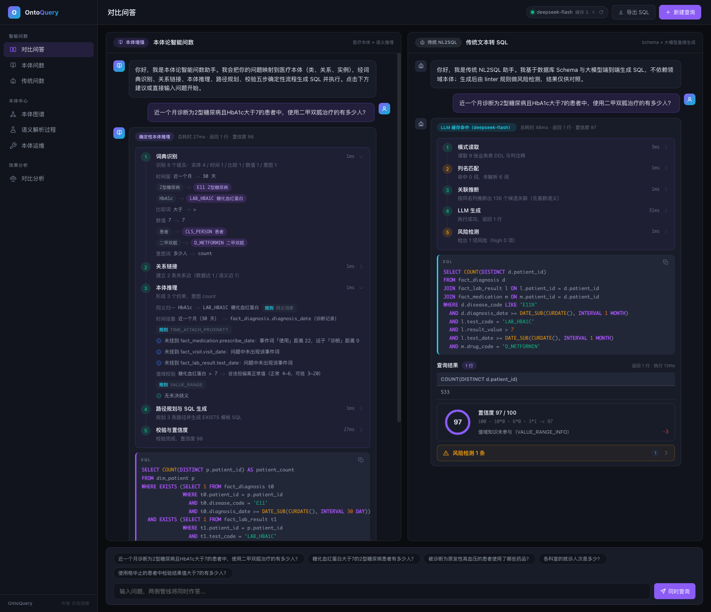

问题：**近一个月诊断为2型糖尿病且HbA1c大于7的患者中，使用二甲双胍治疗的有多少人？**

| 维度 | 本体增强管线 | 传统管线（真实 LLM） |
|---|---|---|
| 答案 | 533 | 533 |
| 端到端耗时 | 26 ms（当日多次实测 24-27 ms） | 首调 26.8 s（另一次实测 18.7 s）；缓存命中后毫秒级 |
| 置信度 | 98 | 97（值域知识未参与，VALUE_RANGE_INFO 扣 3） |
| SQL 形态 | 锚表 COUNT(DISTINCT) + 3 个独立 EXISTS 子查询 | 模型自由生成，三表 JOIN 链 |
| 决策可解释 | 五步轨迹，含时间挂靠未选分支与理由 | 建表语句原文 + 生成文本，无决策依据 |
| token 成本 | 0 | 每题一次 API 调用，按 token 计费 |

本体侧置信度 98 的扣分构成：实体平均得分 0.9425（同义词命中）扣 2 分；无未决歧义、无执行计划警告。

### 6.5 风险检测面板：答案对了，SQL 是脆的

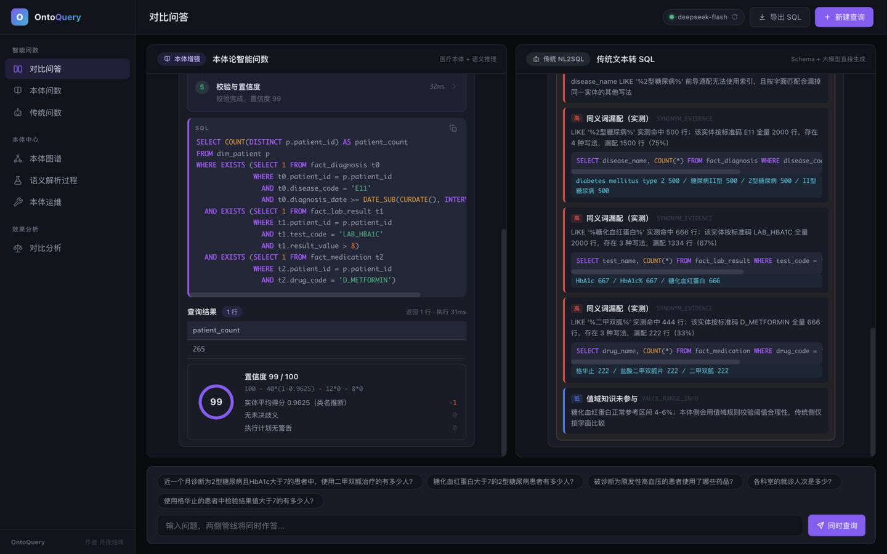

比"答错"更值得看的是"答对但 SQL 脆弱"。图示问题：**近三个月诊断为2型糖尿病且糖化血红蛋白大于8、使用二甲双胍治疗的患者有多少人？** 真实 LLM 答对了（265，与本体侧一致），但生成的 SQL 用 `drug_name LIKE '%二甲双胍%'` 匹配名称列。风险检测跑真实证据查询后给出 5 条风险（4 条高危），传统侧置信度降到 57：

- SYNONYM_EVIDENCE（高危）：LIKE '%二甲双胍%' 实测命中 444 行；该实体按标准码 D_METFORMIN 全量 666 行，存在 3 种写法，**漏配 222 行（33%）**——这次没漏到答案，换一个写法分布就会错；
- 同类证据还量化了糖化血红蛋白、疾病名称列的多写法散布；
- FUZZY_LIKE（高危）：前导通配作用于名称列，无法走索引。

基准题上的答错实锤同样有据可查：

| 基准题 | 传统侧答案 | 黄金答案 | 根因（数据实锤） |
|---|---|---|---|
| q19 同义词理解 | 0（Mock） | 2000 | LIKE 用户原词；E11 共 2000 行、4 种写法各 500，原词字面匹配直接落空 |
| q25 时间修饰歧义 | 20000（Mock）/ 5850（真实 LLM） | 6495 | Mock 时间条件整体丢失退化为数患者总数；真实 LLM 时间窗理解漂移 |
| q13 多表复杂 | 44（Mock） | 265 | LIKE 原词 + LEFT JOIN 链 + COUNT(*) 未去重叠加 |

### 6.6 诚实说明

- **真实 LLM 并非不堪一击**：核心问题它答对了（533），简单单表与两表关联多数能对（各 4/6）。差距集中在三类：列表题只返回首个元素或用名称不用标准码、时间窗口径漂移（5850 对 6495）、多约束组合题漏条件。
- **Mock 模式展示的是缺陷形态，不是大模型水平**：它把"没有本体"时的典型 NL2SQL 错误确定性地演出来，便于逐条归因讲解。
- **本体侧满分有前提**：36 题都在本体词表与规则覆盖之内。超纲问题（如"平均年龄是多少"）会诚实返回"无法解析"，不强行生成。本体的上限是词表与映射的质量，但错误可定位、可修正——修正一行元数据立即生效（见第 9 节）。

## 7. 快速上手

### 7.1 环境准备

1. 本地 MySQL 8（自建演示账号 demo/demo@127.0.0.1:3306，需有建库建表权限；手册命令使用客户端路径 /usr/local/mysql/bin/mysql，按实际安装位置调整）。
2. JDK 21 与 Maven 3.9+（若本机 Maven 运行在更高版本 JDK 上，pom 已 pin release 21，无需处理）。
3. LLM 密钥（可选，传统侧真实调用用）：DeepSeek OpenAI 兼容端点。

### 7.2 四步初始化数据库（命令原文）

```bash
M=/usr/local/mysql/bin/mysql
$M -udemo -pdemo --default-character-set=utf8mb4 < src/main/resources/db/01_schema.sql
$M -udemo -pdemo --default-character-set=utf8mb4 < src/main/resources/db/02_ontology_seed.sql
$M -udemo -pdemo --default-character-set=utf8mb4 < src/main/resources/db/03_data.sql
$M -udemo -pdemo --default-character-set=utf8mb4 < src/main/resources/db/04_ontology_ops.sql
```

- 01 建表：7 张 ont_* 本体元表 + 9 张业务表，全部幂等可重跑。
- 02 本体种子：16 类 / 182 实例 / 94 同义词 / 208 映射等全部元数据。
- 03 确定性数据生成：20,000 患者 / 40,000 就诊 / 60,000 诊断 / 120,000 检验 / 90,000 用药，纯 SQL 无随机函数，重跑逐位一致（净室双重重建已验证）。
- 04 本体运维审计表 ont_change_log；重跑 02 会让本体回到出厂状态，审计表不受影响。

### 7.3 配置 LLM 密钥（可选）

项目根目录新建 `local.yml`（已被 gitignore 忽略）：

```yaml
ontoquery:
  llm:
    api-key: sk-你的密钥
```

或设置环境变量 `ONTOQUERY_LLM_API_KEY`。未配置时传统侧自动降级确定性 Mock 生成器（UI 琥珀徽标注明"模拟模式"），系统照常可用，本体侧不受任何影响。

### 7.4 构建与启动

```bash
mvn -q package          # 构建
mvn spring-boot:run     # 启动，端口 8080
```

浏览器打开 http://localhost:8080 ，从"对比问答"页开始。若 8080 被占用，`server.port` 可在 local.yml 覆盖。

## 8. 七页操作指引

### 页面一：对比问答（#/compare，主演示页）


- **怎么进**：启动后默认页，或点左侧导航"对比问答"。
- **页面结构**：双栏对话布局，左栏"本体论智能问数"、右栏"传统文本转 SQL"，底部共享输入框与 5 个建议芯片（第一个即核心演示问题）。
- **点哪里**：点第一个建议芯片，按"同时查询"。
- **看什么**：左栏答案 533、置信度 98；点开"词典识别"与"本体推理"步骤，看到同义归一（HbA1c -> LAB_HBA1C）、时间挂靠（"近一个月"挂 diagnosis_date，并列出未挂到 test_date / prescribe_date 的理由）、值域校验（正常 4-6、可信 3-20、阈值 7 合法）；SQL 块中三个独立 EXISTS 各管一个约束。
- **讲解要点**：每个决策有规则依据，这就是可审计；EXISTS 天然免疫 JOIN 扇出；右栏右上角模式徽标说明当前处于"LLM 真实调用 / 缓存命中 / 模拟模式"哪种状态。


- **风险面板**：换问"近三个月诊断为2型糖尿病且糖化血红蛋白大于8、使用二甲双胍治疗的患者有多少人？"并展开右栏"风险检测"面板——两侧都答 265，但传统侧 5 条风险 4 条高危、置信度 57，证据行"LIKE '%二甲双胍%' 命中 444 行 / 标准码全量 666 行 / 漏配 222 行（33%）"可直接念给观众。
- **安全演示（可选）**：输入"删除患者表"——传统侧把破坏性请求转成 information_schema 元数据检查（无害只读），本体侧退化为无害计数 SELECT（答 20000，即患者总数）。两侧都不可能写库，所有 SQL 只经 SafeQueryExecutor 白名单。

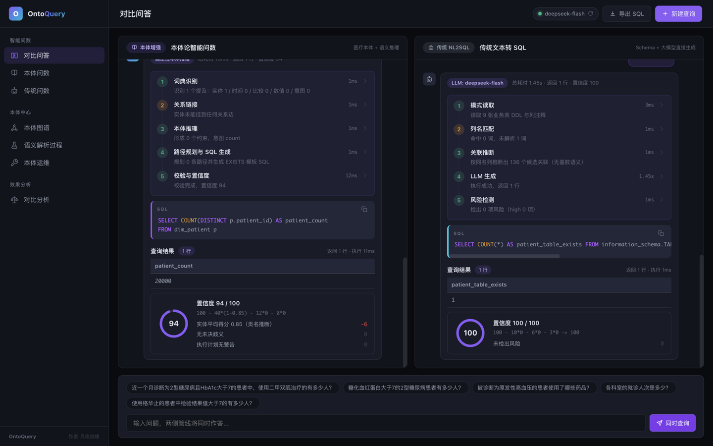

### 页面二：本体问数（#/ontology-qa）

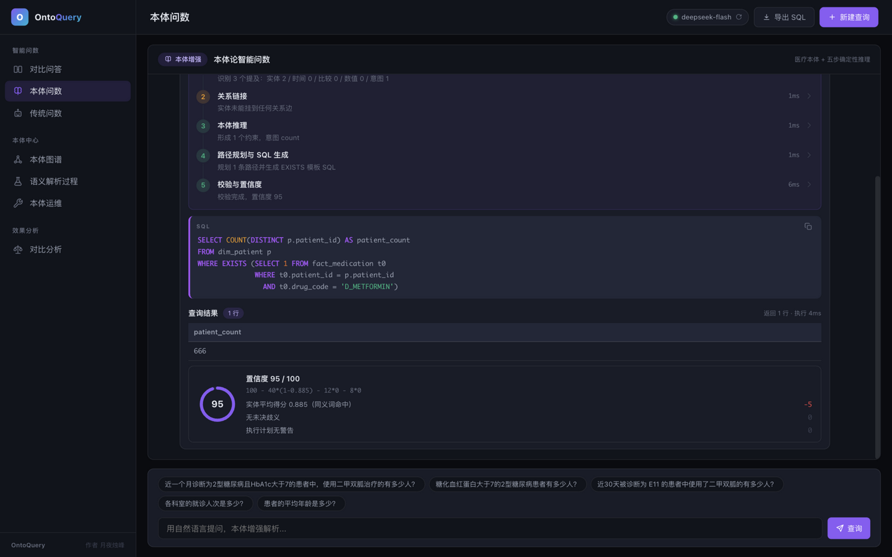

- **怎么进**：左侧导航"本体问数"。
- **建议操作三个变形问题**：
  1. "使用格华止治疗的患者有多少人？"——同义归一，4 毫秒答 666，生成的 SQL 与用标准名"二甲双胍"完全一致（图示即此问题，置信度 95）；
  2. "HbA1c 大于 70 的患者"——值域校验警告：超出可信区间 3-20，疑似单位错误；
  3. "各科室的就诊人次是多少？"——分组计数意图。
- **讲解要点**：单管线全屏聚焦本体侧内部过程；再输入一个超纲问题（如"平均年龄是多少"），系统如实返回"无法解析"，不硬编不猜测。

### 页面三：传统问数（#/traditional-qa）

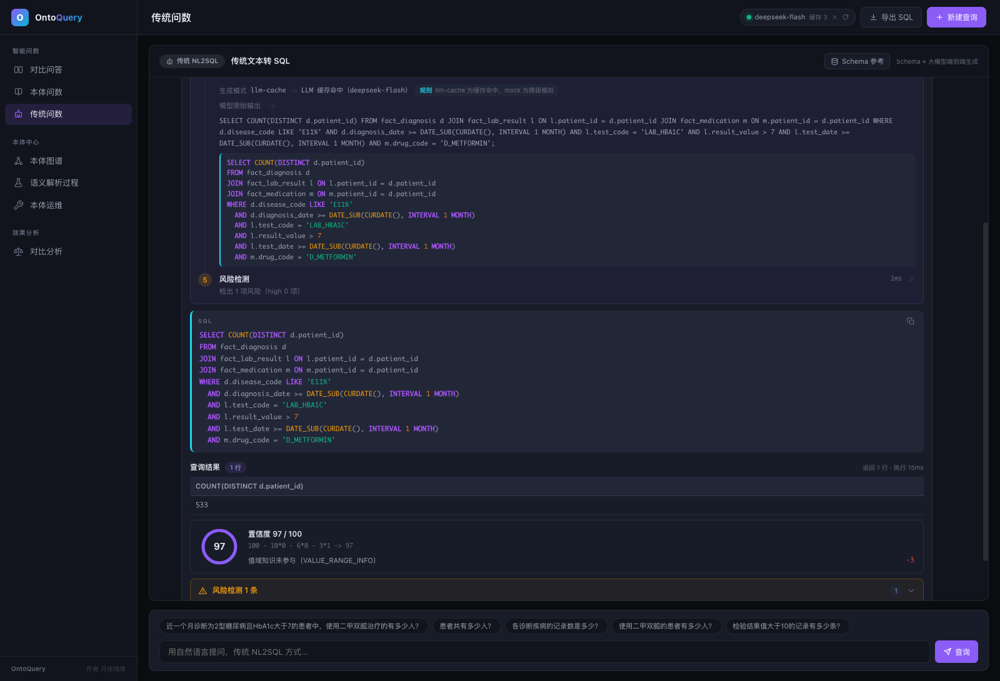

- **怎么进**：左侧导航"传统问数"。
- **操作**：输入同一个核心问题单独跑传统侧，观察模式徽标（真实 LLM / 缓存命中 / 模拟模式）与风险检测面板；清空缓存后首调可现场感受约 19 到 27 秒的延迟。
- **讲解要点**：界面与对比页右栏一致，单独跑便于聚焦讲解传统路线的内部步骤——列名匹配命中 0 词、LLM 生成一步只能看到建表语句原文与生成文本。

### 页面四：本体图谱（#/graph）

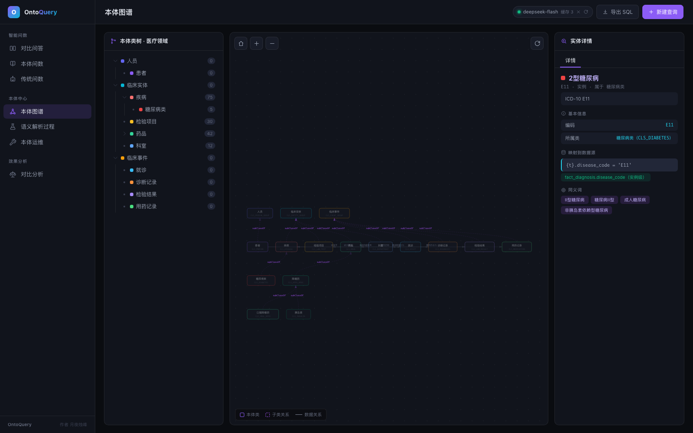

- **怎么进**：左侧导航"本体中心 - 本体图谱"。
- **页面结构**：三栏联动——左：类树（节点带真实实例数徽标）；中：SVG 关系图画布（数据关系实线箭头、subClassOf 虚线、分层布局、支持缩放平移）；右：详情面板。
- **点哪里**：类树中依次展开"临床实体 -> 疾病 -> 糖尿病类"，在右侧"实例"标签页点 E11。
- **看什么**：E11 详情含 4 个同义词（II型糖尿病 / 糖尿病II型 / 成人糖尿病 / 非胰岛素依赖型糖尿病）、映射芯片 `fact_diagnosis.disease_code = 'E11'`、所属类与对象关系。
- **讲解要点**：本体不是黑盒，它本身就是资产。业务方在这里核对同义词与层级，改一行元数据全站生效——这是本体路线的运维逻辑（见第 9 节）。

### 页面五：语义解析过程（#/parser）

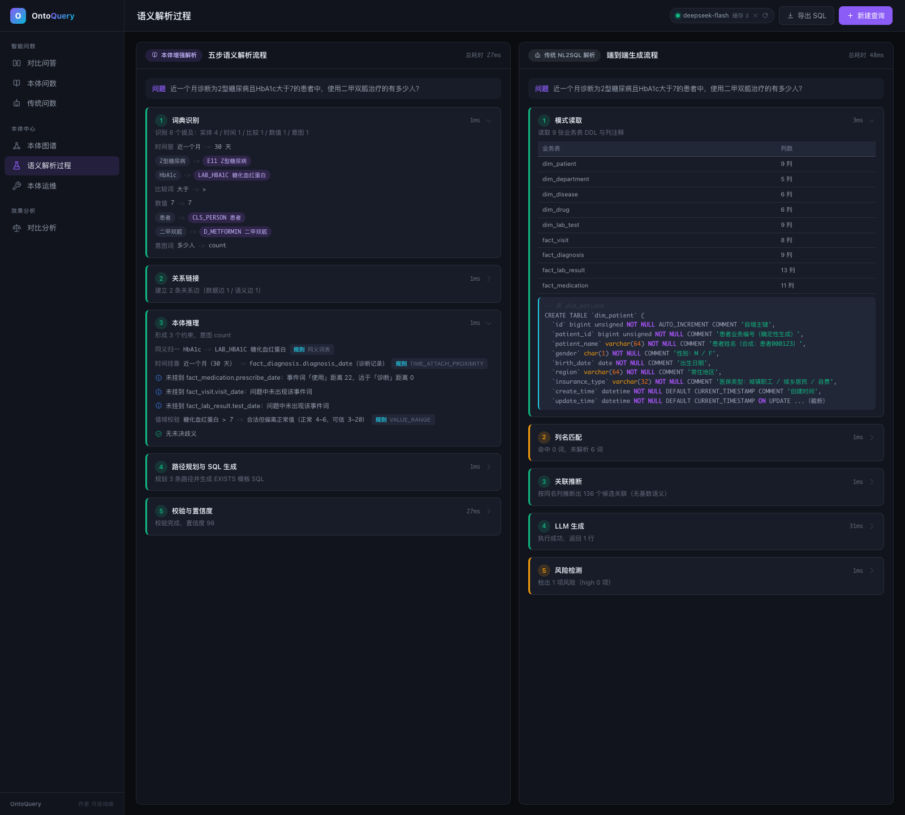

- **怎么进**：左侧导航"语义解析过程"。读取最近一次对比问答的双侧五步轨迹；无缓存时自动执行一次核心问题。
- **看什么**：逐项展开双侧步骤。重点看左侧时间挂靠的"未选中分支说明"（如"未挂到 fact_lab_result.test_date：距离远于诊断词"）；对照右侧的建表语句原文。
- **讲解要点**：同一道题，一边是带规则依据的决策树，一边是端到端生成——可解释性的差距在这一页最直观。

### 页面六：本体运维（#/ops）

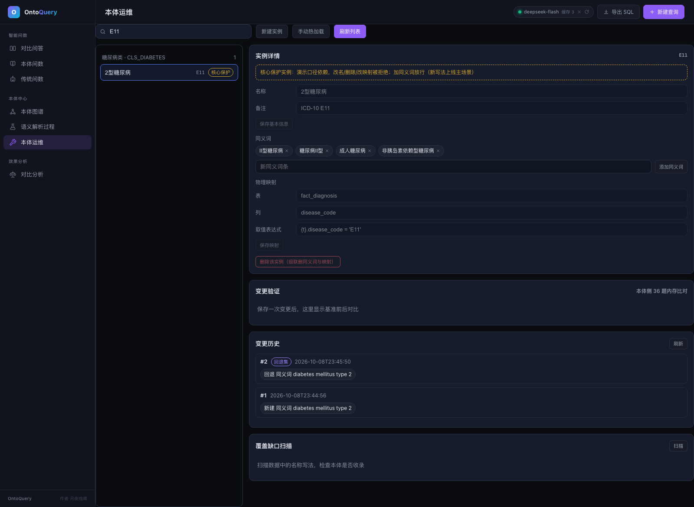

- **怎么进**：左侧导航"本体运维"。
- **页面结构**：左栏按类浏览/搜索实例；右侧编辑区含基本信息（名称/备注）、同义词胶囊、物理映射（表/列/取值表达式）、变更验证卡、变更历史、覆盖缺口扫描。
- **点哪里**：搜索框输入 E11，选中"2型糖尿病"——编辑器带出 4 个同义词与映射 `{t}.disease_code = 'E11'`；核心演示实例（E11 / D_METFORMIN / LAB_HBA1C）有"核心保护"徽标：改名、删除、改映射被拒绝，加同义词放行（新写法上线的主场景）。
- **完整闭环实录**见第 9 节（配三张截图：覆盖扫描、收录验证、回退）。

### 页面七：效果分析（#/comparison）

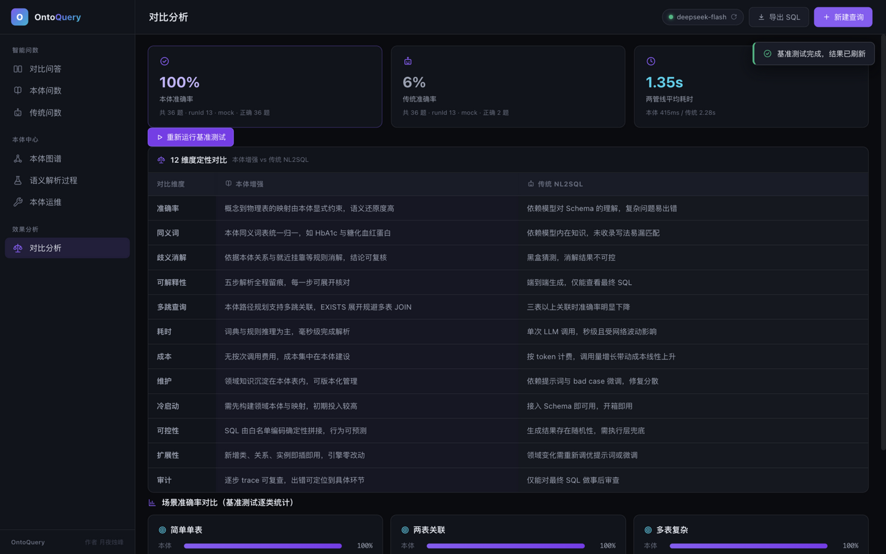

- **怎么进**：左侧导航"效果分析"。
- **页面结构**：顶部指标卡（本体准确率 / 传统准确率 / 平均耗时，来自最近一次基准）；12 维度定性对比表（准确率、同义词、歧义消解、可解释性、多跳查询、耗时、成本、维护、冷启动、可控性、扩展性、审计）；6 个场景卡对应基准六类目。
- **点哪里**：点"重新运行基准测试"按钮，秒级跑完 36 题 Mock 基准并刷新指标卡（图示即当晚实测：本体 100% / 传统 6%）；顶栏 LLM 状态芯片显示模型、缓存条目与最近模式，缓存非空时右侧出现清空按钮（演示前重置用）。
- **讲解要点**：指标卡数字全部来自 `GET /api/benchmark/latest`，未跑过基准时显示占位并标注"尚未运行基准结果"。真实 LLM 基准（`POST /api/benchmark/run` 不带参数）串行约 2 到 10 分钟，建议演示前预先跑好。

### 15 分钟演示动线建议

| 时间 | 页面 | 动作 |
|---|---|---|
| 0:00-1:00 | 演示前 | 确认数据库已初始化、应用运行；点顶栏芯片清空 LLM 缓存；确认传统侧模式徽标（紫"LLM: deepseek-flash"或琥珀"模拟模式"） |
| 1:00-1:30 | 开场 | 定位一句话：同一问题、两种路线的对照实验；今天看五件事——准不准、为什么错、能不能解释、贵不贵、口径怎么改 |
| 1:30-4:30 | 对比问答 | 核心问题：五步轨迹 -> SQL 三个 EXISTS -> 答案与置信度 -> 换风险题看 5 条风险与漏配 33% 实锤（可加"删除患者表"安全演示） |
| 4:30-5:30 | 本体问数 | "格华止"同义归一；"HbA1c 大于 70"值域警告；超纲问题如实报错 |
| 5:30-6:30 | 本体图谱 | 类树 -> 糖尿病类 -> E11：同义词与映射芯片，讲"本体即资产" |
| 6:30-7:30 | 语义解析过程 | 时间挂靠未选分支说明，对照传统侧 DDL 原文 |
| 7:30-9:30 | 本体运维 | 覆盖扫描发现英文写法 500 行 -> 一键收录 -> 验证卡 -> 一键回退，讲"改口径是一次数据操作" |
| 9:30-12:00 | 效果分析 | 现场跑 Mock 基准（秒级）；按类目讲准确率；12 维度挑可解释性、运维方式、成本三个讲；引用真实 LLM 基准（run 9：传统 18/36、148.8 秒；本体 36/36、466 毫秒） |
| 12:00-15:00 | 答疑 | 常见问题见 docs/demo-script.md 的 FAQ（真实大模型水平、两侧会不会改库、数据是不是真的等） |

## 9. 本体资产的维护方式

### 9.1 维护入口与运维闭环


本体的维护有三个入口，全部围绕同一套元表与审计机制：

1. **本体运维页（#/ops）**：浏览器里编辑实例、同义词、映射，保存自动热加载并重跑验证（推荐，下面全程演示）；
2. **ont_* 七张元表**：直接 SQL 维护，表带 create_time / update_time，重启应用后生效；
3. **本体图谱页（#/graph）**：可视化查看类层级、实例、同义词、映射，供业务专家核对。

与传统路线改口径对比：传统 NL2SQL 改口径只能改提示词然后全量重测，无逐字审计、无基准前后比对、无回退；本体路线的改口径是一次可审计、可回退、免重启的数据操作。

### 9.2 实录：让系统认识一个新写法，一次闭环约 90 秒

以下为 2026-10-08 晚在演示环境的真实操作记录（变更集编号 #1 至 #4 均可在页面回查）。

**第一步：覆盖缺口扫描，让数据说话。**

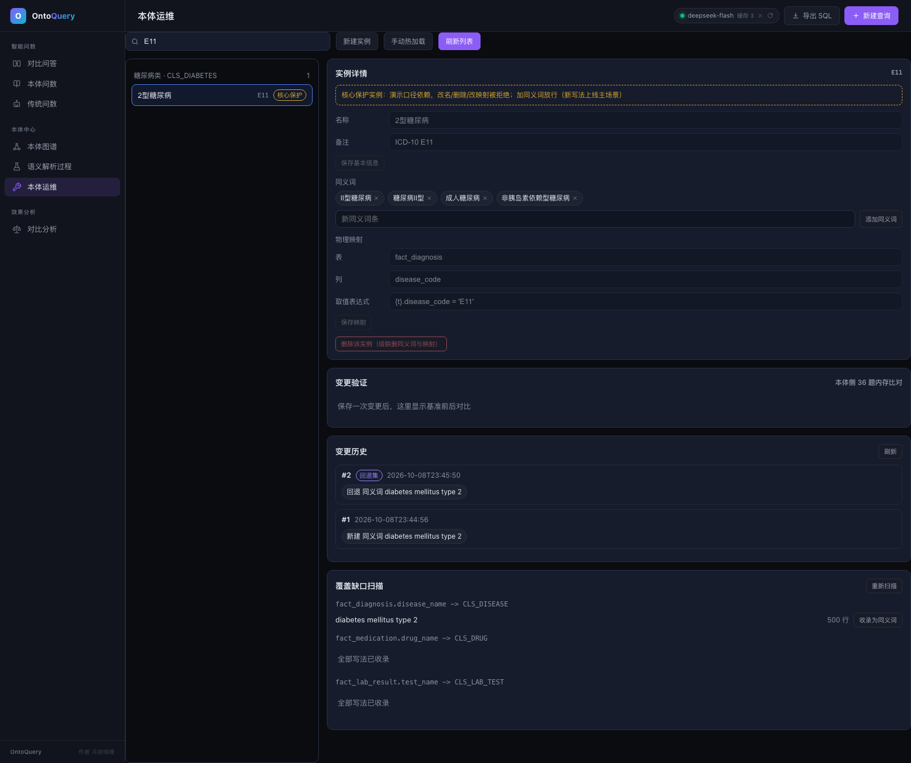

点"扫描覆盖缺口"，系统比对三组名称列（诊断 / 用药 / 检验）与本体词表，报告：fact_diagnosis.disease_name 中存在写法 `diabetes mellitus type 2` 共 **500 行**未被本体收录（另外两组"全部写法已收录"）。这正是 3.1 节 E11 四种写法里唯一没进同义词表的那个——数据里真实存在，本体没认识。

**第二步：一键收录，选择挂载实例。**

点"收录为同义词"，弹层预填写法，实例下拉按类集合过滤（疾病类），选择"2型糖尿病（E11）"，按"收录并验证"。

**第三步：自动热加载加 36 题复测，验证卡呈现前后对比。**

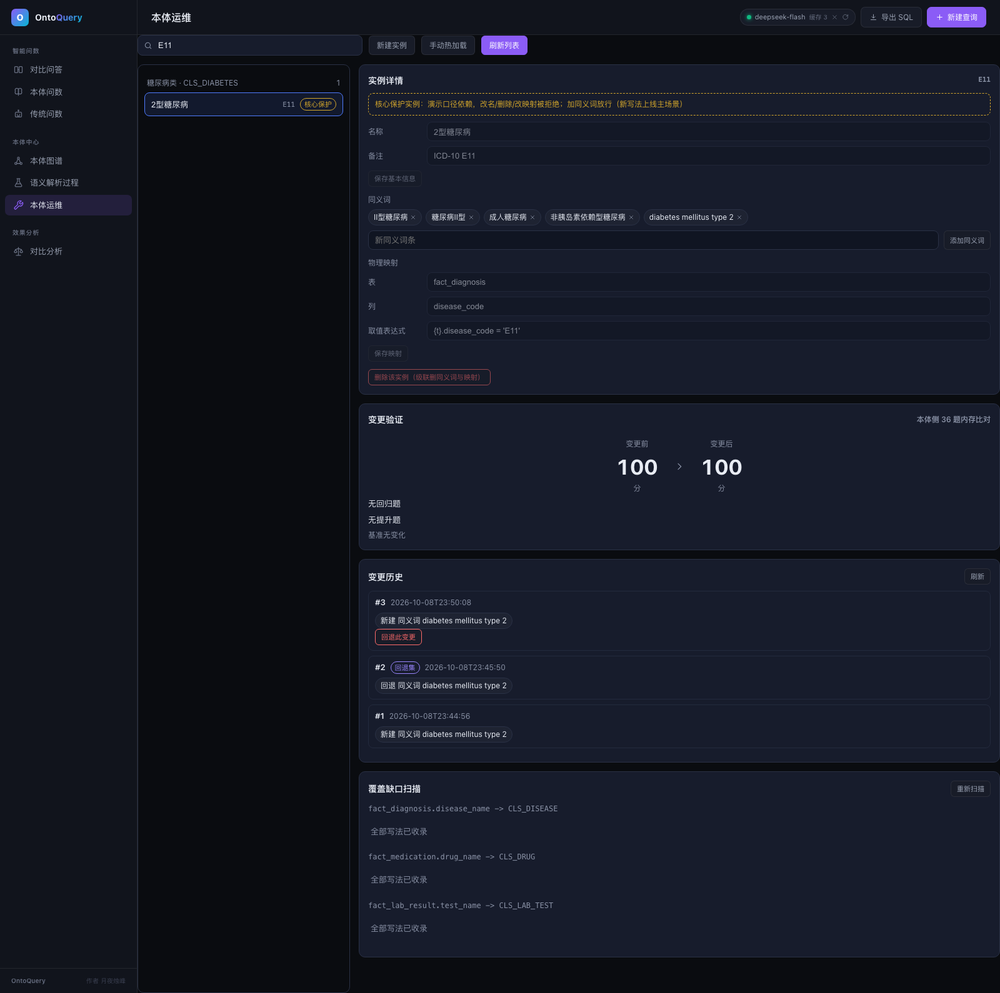

保存即触发：事务写入 ont_synonym 并落审计（变更集 #3）-> 内存本体热替换，免重启 -> 本体侧 36 题基准在内存重跑比对。验证卡显示：**变更前 100 分 -> 变更后 100 分，无回归题、无提升题、基准无变化**——新增一个英文写法的识别能力，没有破坏任何既有口径（内存比对，不污染正式基准历史）。

**第四步：一键回退，口径还原且可追溯。**

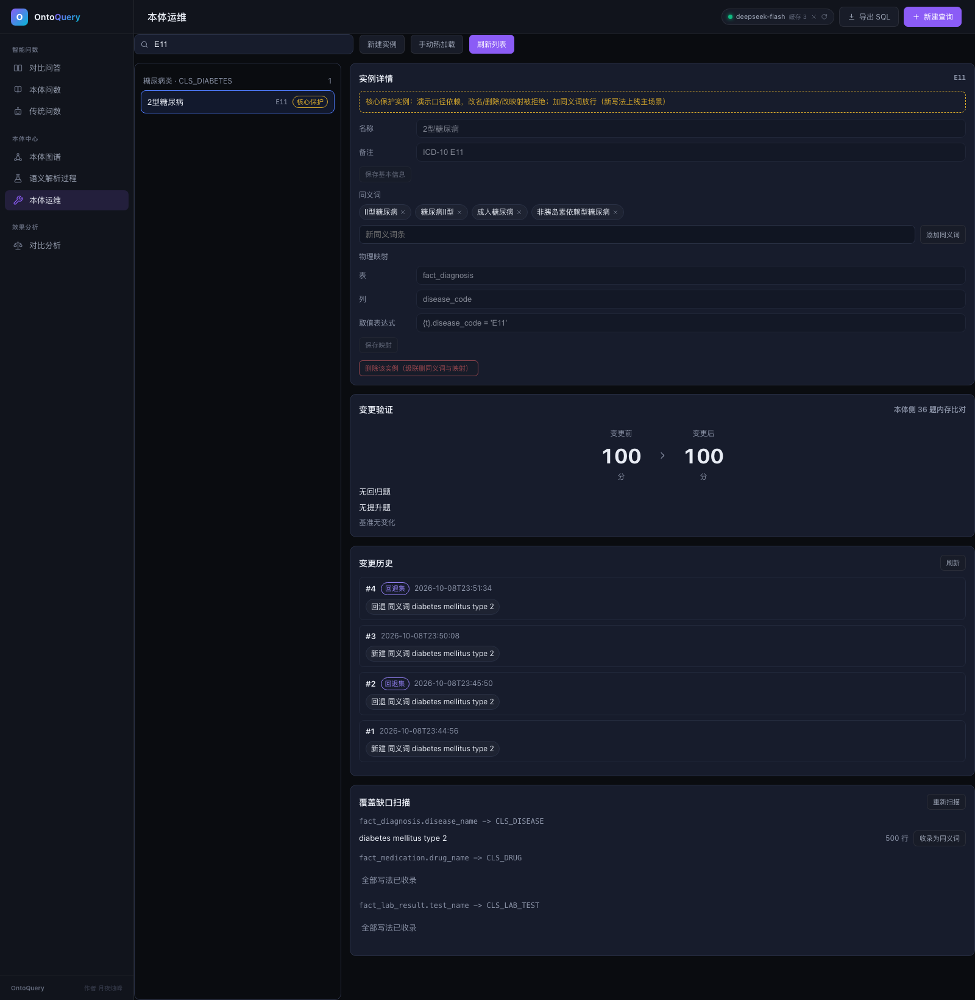

演示后按"回退此变更"：系统按操作前镜像逆序恢复，同义词总数回到 94，覆盖扫描重新出现该缺口（演示种子状态还原）；回退本身记录为变更集 #4（回退集），与 #1 至 #3 一起构成完整审计链：每次改了什么、谁改的、何时改的、有没有回退，逐行可查。

**护栏**（页面上均有对应拦截与 5 位错误码）：核心演示实例改名/删除/改映射锁定（A0403）；映射取值表达式白名单校验（B0501）；最新变更已是回退集时不可连续回退（A0410）。

### 9.3 例：物理结构变化只改映射

若某张事实表列名调整（如 disease_code 改名），只改 ont_mapping 中对应实例的 value_expr（`{t}.disease_code = 'E11'` 换成新列名），推理引擎与既有查询能力不受影响。本体与物理存储解耦，`{t}` 别名占位符由路径规划按到达关系解析。

### 9.4 与提示词路线的运维对比

改的是一行元数据，不是任何代码，也不是任何提示词。与"反复调 prompt 期望大模型记住新口径"相比：本体变更就是一条数据，可评审（本体可 diff）、可验证（36 题自动复测）、可回退（镜像逆序恢复）、生效范围明确（全站所有经过该实例的查询），且无需重新训练、无需重启、零 token 成本。

## 10. 边界与适用场景

如实说明边界，这比夸大覆盖更有价值：

- **意图覆盖四类**：计数、分组计数、TopN、均值。超纲问题返回可解释的"无法解析"错误，绝不强行生成可能错误的 SQL。
- **本体质量决定上限**：词表缺词、映射写错会系统性出错。但本体路线的运维优势恰在于错误可定位（结构化轨迹）、可修正（改元数据立即生效）、可评审（本体就是数据，可 diff、可审计）。传统路线的错误只能靠翻日志猜。
- **传统侧输出有随机性**：temperature 0、SHA256 响应缓存、Mock 确定性降级三种手段保证演示可复现；当前处于哪种模式由徽标如实标注。
- **适合的场景**：领域固定、统计口径稳定、查询模式可枚举的内部分析查询——医疗质控、保险理赔统计、金融风控指标、经营分析报表等；对可解释性、审计合规、响应延迟（毫秒级对秒级）、边际成本（零 token）敏感的场景尤为合适。
- **不适合的场景**：本体未覆盖的开放域即席探索。该场景下传统 LLM 路线仍是合理选择；更实际的做法是先在运维页扫描覆盖缺口、扩充本体元数据，再纳入确定性查询范围。

## 11. 技术规格

| 项 | 规格 |
|---|---|
| 后端 | Java 21 + Spring Boot 3.5.16；依赖仅 starter-web / starter-jdbc / mysql-connector-j / starter-test；无 JPA、无 Lombok；LLM 调用用 JDK 内置 HttpClient；线程池手动创建并命名 |
| 数据库 | MySQL 8（演示环境 8.0.28）；无视图、无存储过程、无外键（只用索引）；账号最小权限 |
| 前端 | 原生 ES module SPA，hash 路由，零构建零第三方库；33 个内联 SVG 图标；全站禁 emoji；用户数据输出前统一 escapeHtml 转义 |
| 数据规模 | dim_patient 20,000 / fact_visit 40,000 / fact_diagnosis 60,000 / fact_lab_result 120,000 / fact_medication 90,000，事实行合计 31 万；纯 SQL 确定性生成，净室双重重建逐位一致 |
| 本体规模 | 16 类 / 182 实例 / 94 同义词 / 8 关系 / 13 属性 / 208 映射 / 3 规则 |
| 本体运维 | 实例/同义词/映射在线编辑；保存自动热加载 + 36 题内存复测；变更集审计（ont_change_log）与一键回退；覆盖缺口扫描三组名称列 |
| 质量 | 77/77 单元测试通过（含核心 SQL 生成的逐字符断言、SQL 执行器注入边界用例） |
| 编码规约 | 遵循阿里《Java开发手册（嵩山版）》强制条目（命名、包装类型、异常与日志、并发、MySQL 建表、参数绑定等） |
| 安全 | SafeQueryExecutor 白名单（单条 SELECT/WITH、10 秒超时、500 行上限）为两侧唯一 SQL 出口；证据查询 PreparedStatement 参数绑定；本体写操作全参数绑定并过 valueExpr 白名单；错误响应统一 5 位错误码加 message；LLM 密钥不入仓库 |
| 构建产物 | mvn -q package，jar 约 24 MB；mvn spring-boot:run 启动，端口 8080 |

常用接口（完整契约见 docs/CONTRACT.md）：

| 方法 | 路径 | 说明 |
|---|---|---|
| POST | /api/query/compare | 双管线并行对比（主演示入口） |
| POST | /api/query/ontology | 仅本体管线 |
| POST | /api/query/traditional | 仅传统管线 |
| GET | /api/ontology/tree / graph / entity/{code} | 本体图谱三端点 |
| GET / POST | /api/ontology/admin/* | 本体运维：实例/同义词/映射编辑、热加载、变更历史、回退、覆盖扫描（契约第 9 节） |
| GET | /api/meta/tables / llm-status | 数据源与 LLM 状态 |
| POST | /api/meta/llm-cache/clear | 清空 LLM 缓存（演示前重置） |
| POST | /api/benchmark/run?forceMock=true | 36 题基准（Mock 秒级；缺省走真实 LLM 较慢） |
| GET | /api/benchmark/latest | 最近一次基准结果 |

## 12. 文档索引

| 文档 | 内容 |
|---|---|
| README.md | 快速开始、环境准备、目录结构 |
| docs/design.md | 方案设计：架构、本体模型、双管线、数据策略、基准 harness |
| docs/CONTRACT.md | API 契约（字段级，前后端严格对齐） |
| docs/prototype.md | 原型与页面说明（七页面结构与组件） |
| docs/demo-script.md | 演示讲解词与 FAQ |

---

作者：月夜烛峰

OntoQuery v2.0.0 · 本手册数字实测日期 2026-10-08
